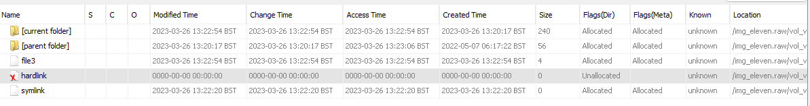
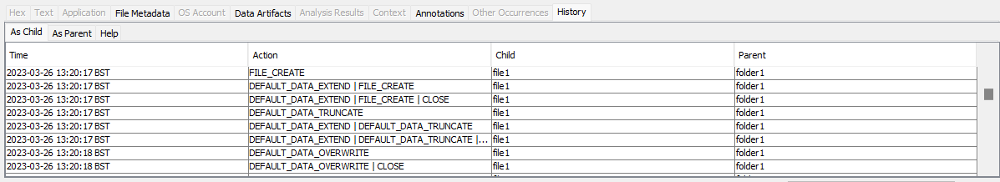
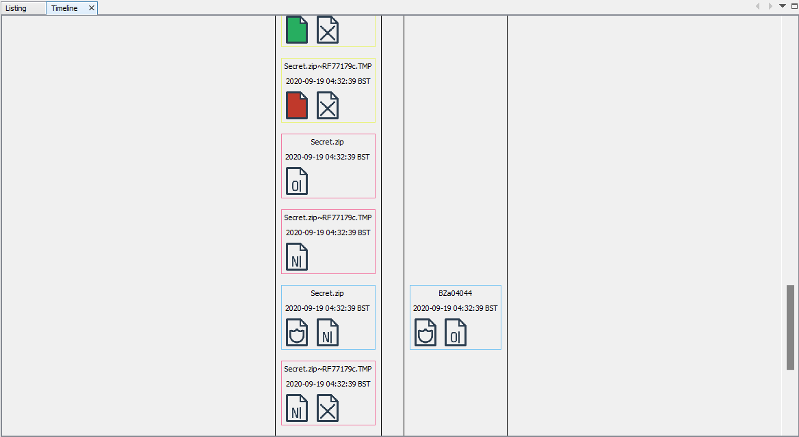

# USN Correlation

## Installation

- Download the latest `.nbm` file from [releases](https://github.com/Oshawk/usn-correlation/releases).
- In Autopsy, go to `Tools > Plugins > Downloaded`.
- Click `Add Plugins...` and select the `.nbm` file downloaded earlier.
- Click `Install` and follow the steps.

## Usage

### Ingest

The plugin has an ingest component that can be used to display metadata about deleted files in Autopsy's file viewer. Simply select `UsnCorrelation` from the list of ingest modules when adding a data source.

### Tabular Timeline

When a file is selected in Autopsy's file viewer, a timeline displaying its history can be accessed via the `History` tab in the bottom left.

Two timelines are available:

- A **child** timeline containing the history of a specific file.
- A **parent** timeline containing the history of a specific folder's contents.

Cells in the `Child` or `Parent` columns can be double clicked for fast navigation.

Tabular timelines can also be exported by right-clicking on a file in Autopsy's file viewer and selecting `Export Timeline`.

### Graphical Timeline

A file's graphical timeline can be displayed by right-clicking on it in Autopsy's file viewer and selecting `View Timeline`.

Two timelines are available:

- A **child** timeline showing the journey of a specific file.
- A **parent** timeline showing the journey of every file that has ever been in a specific folder.

The meaning of an icon can be displayed by hovering over it.

